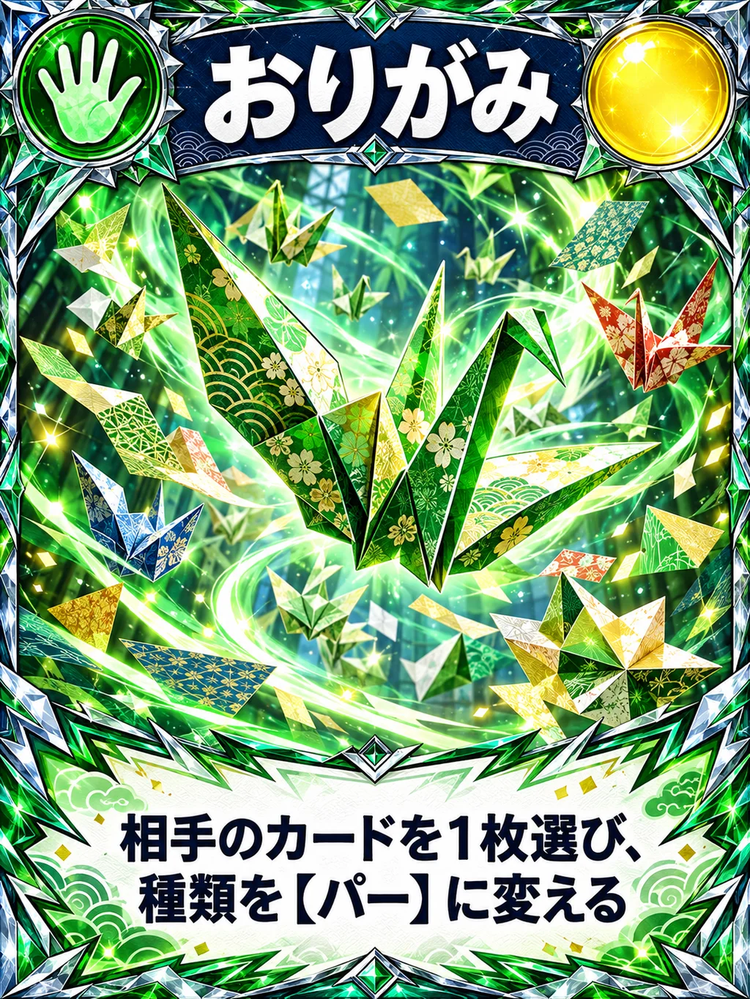
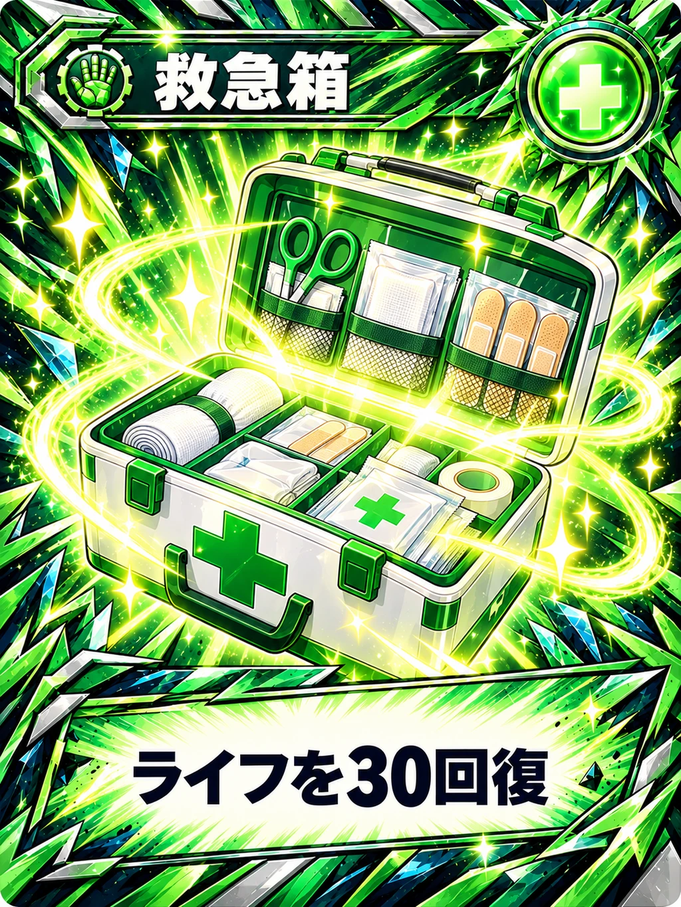
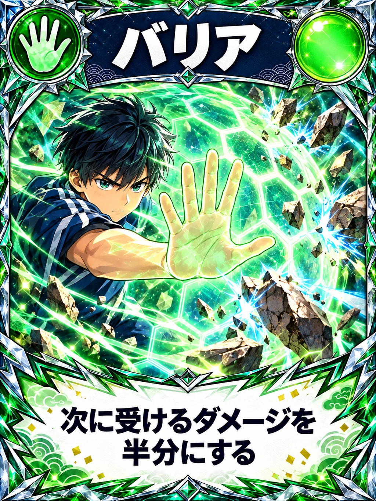
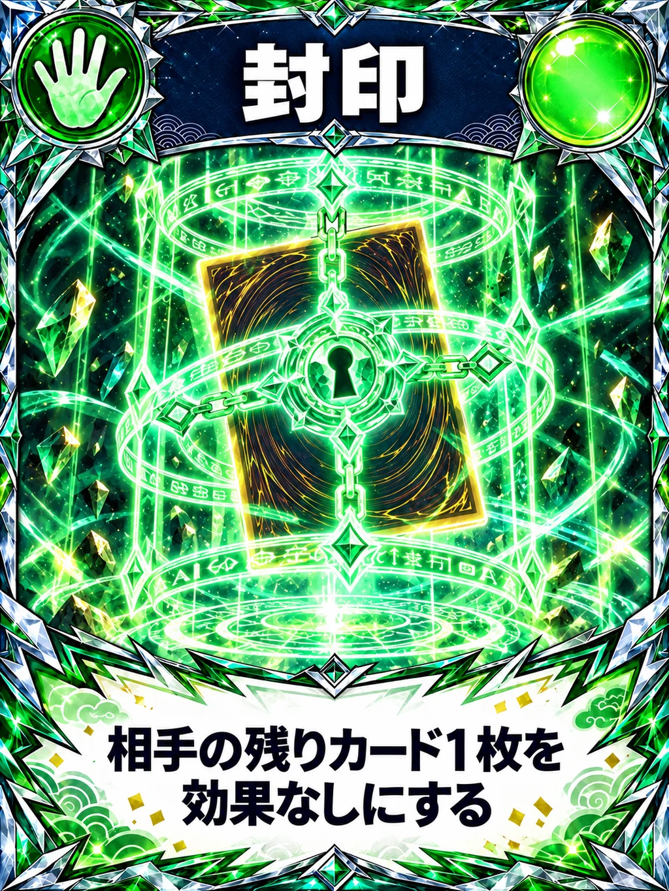
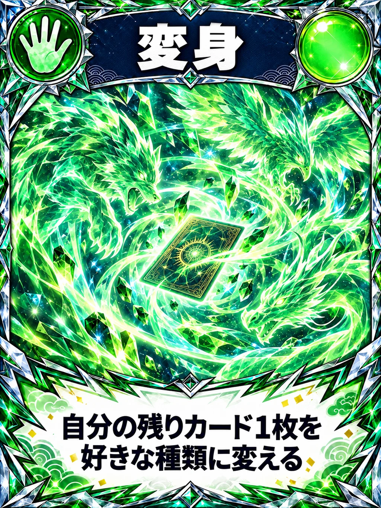
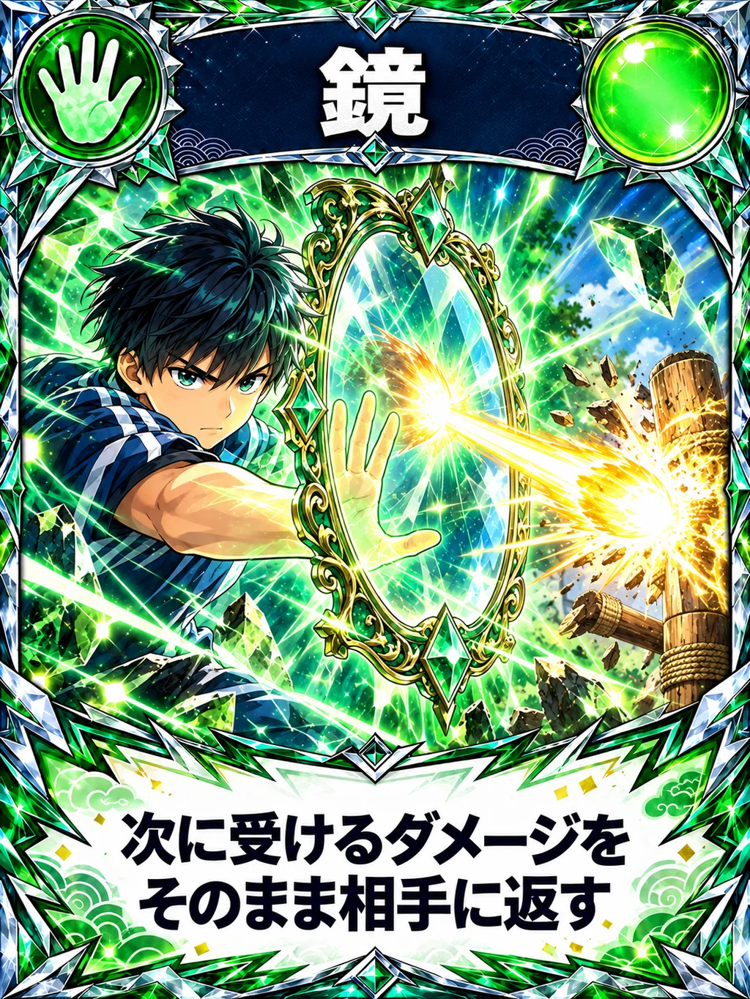
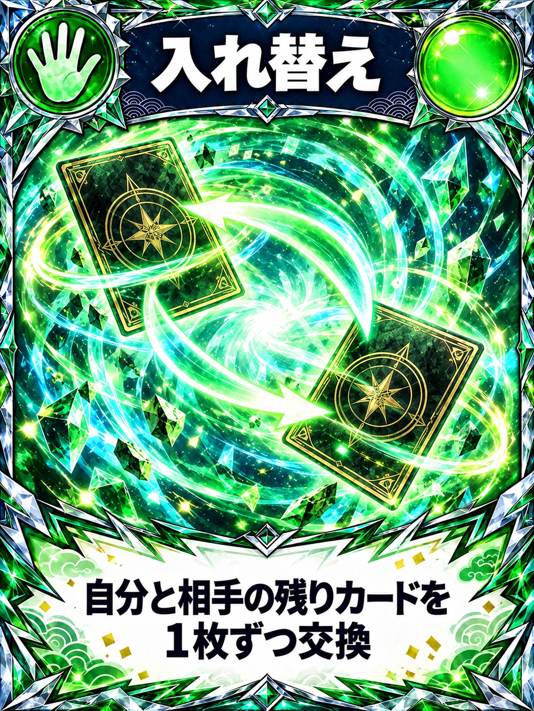
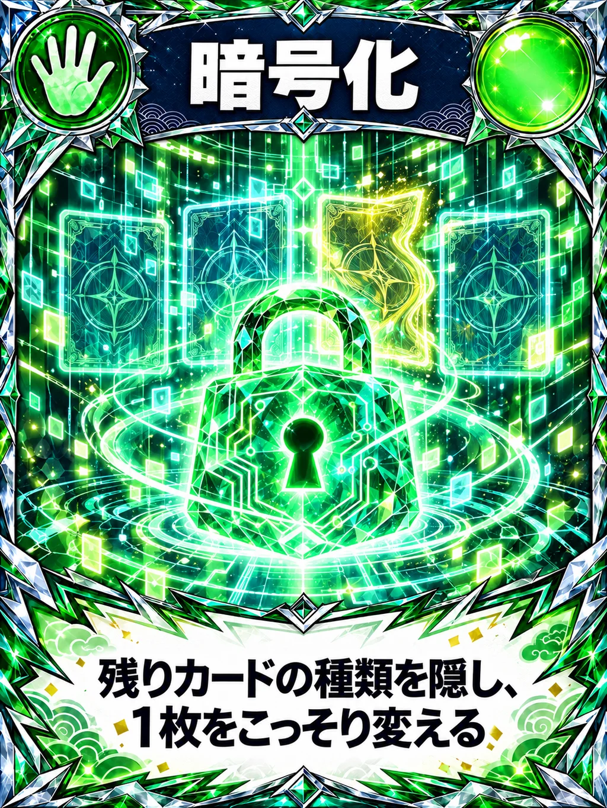
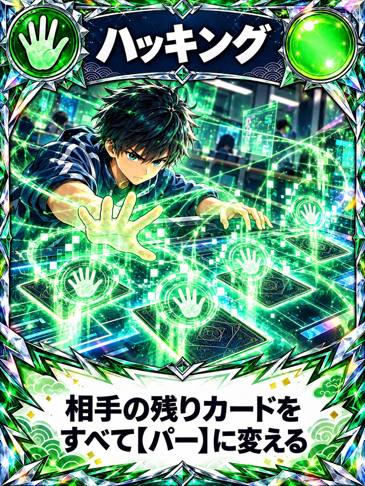
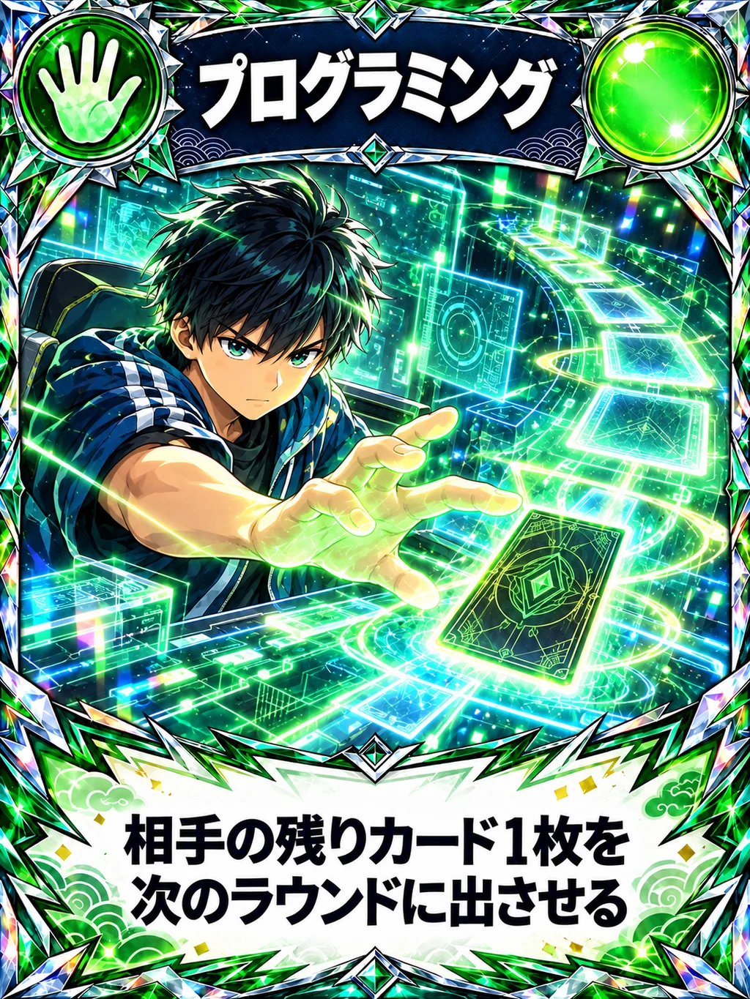

# パー（13枚）

[40枚の一覧へ](README.md)

## P001 手品（既存）

## P002 催眠術（既存）

## P017 おりがみ（既存）

## P003 救急箱（既存）

## P005 バリア

## P007 封印

## P004 変身

## P008 吸収

## P010 鏡

## P009 入れ替え

## P018 暗号化

## P015 ハッキング

## P014 プログラミング

