# グー（14枚）

[40枚の一覧へ](README.md)

## G001 パンチ（既存）

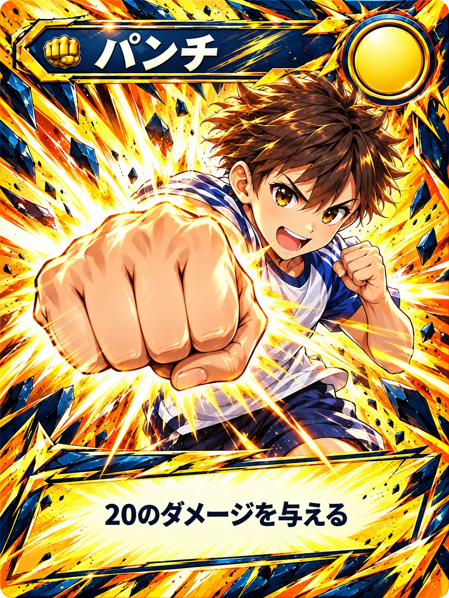

## G002 キック（既存）

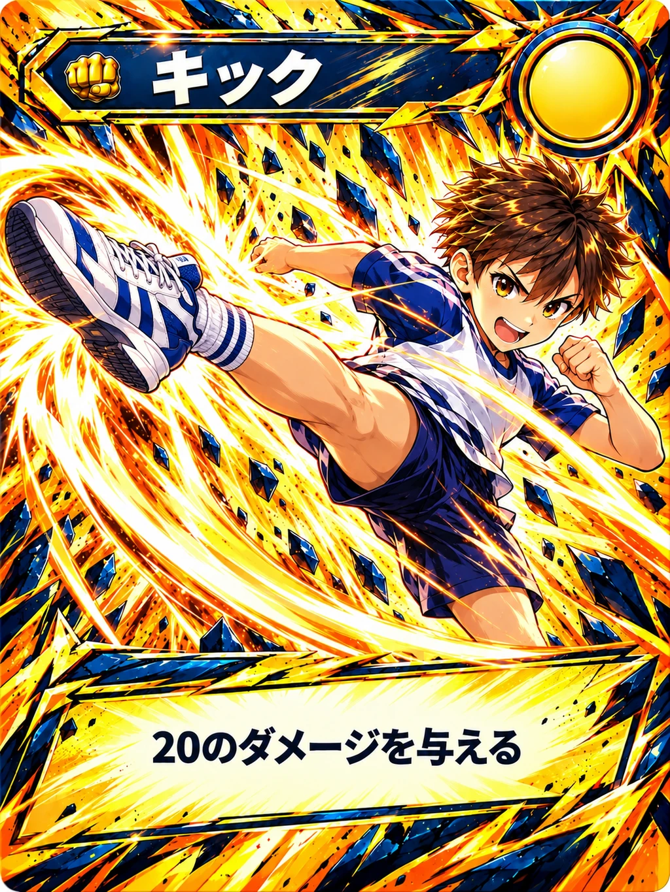

## G018 人力発電

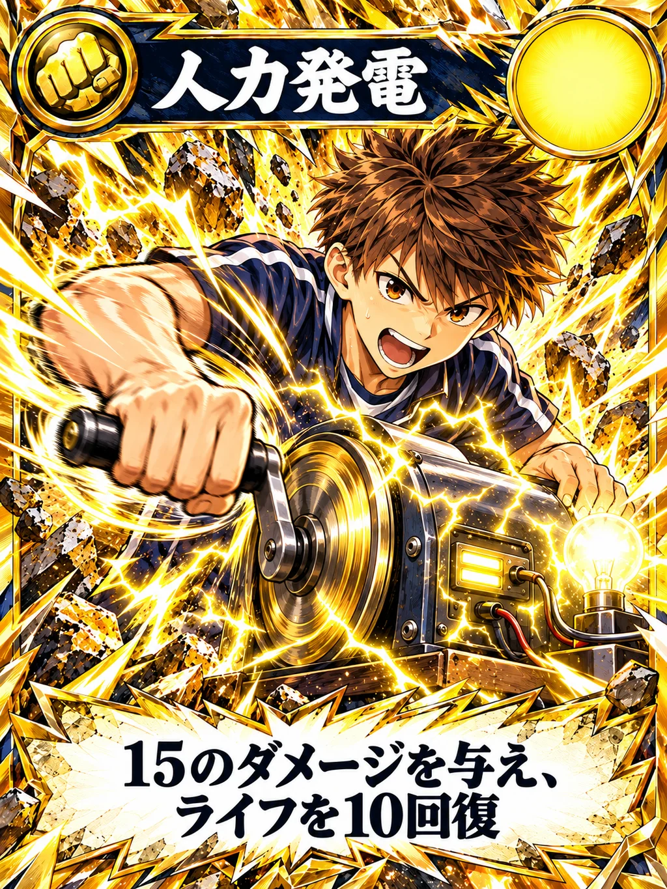

## G019 歯車

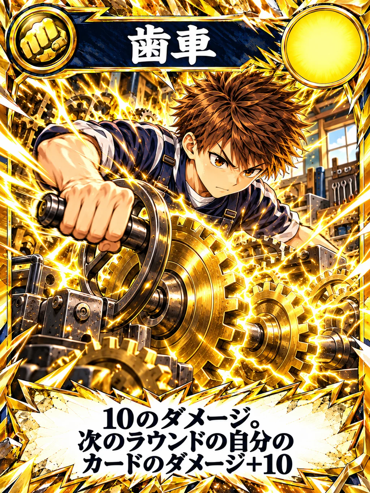

## G006 正拳突き（既存）

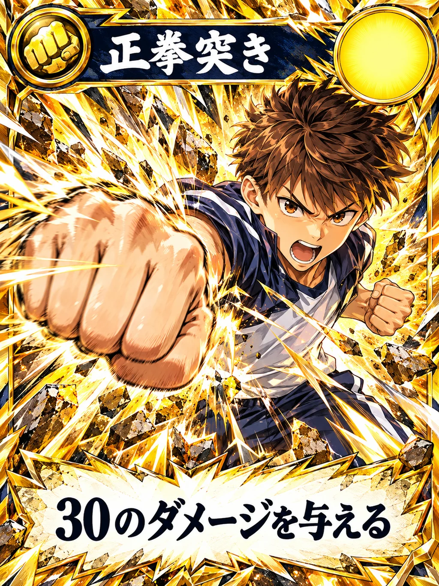

## G007 連続パンチ

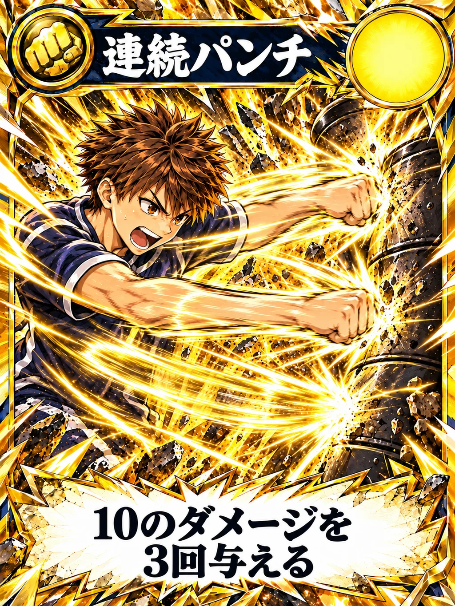

## G020 てこの原理

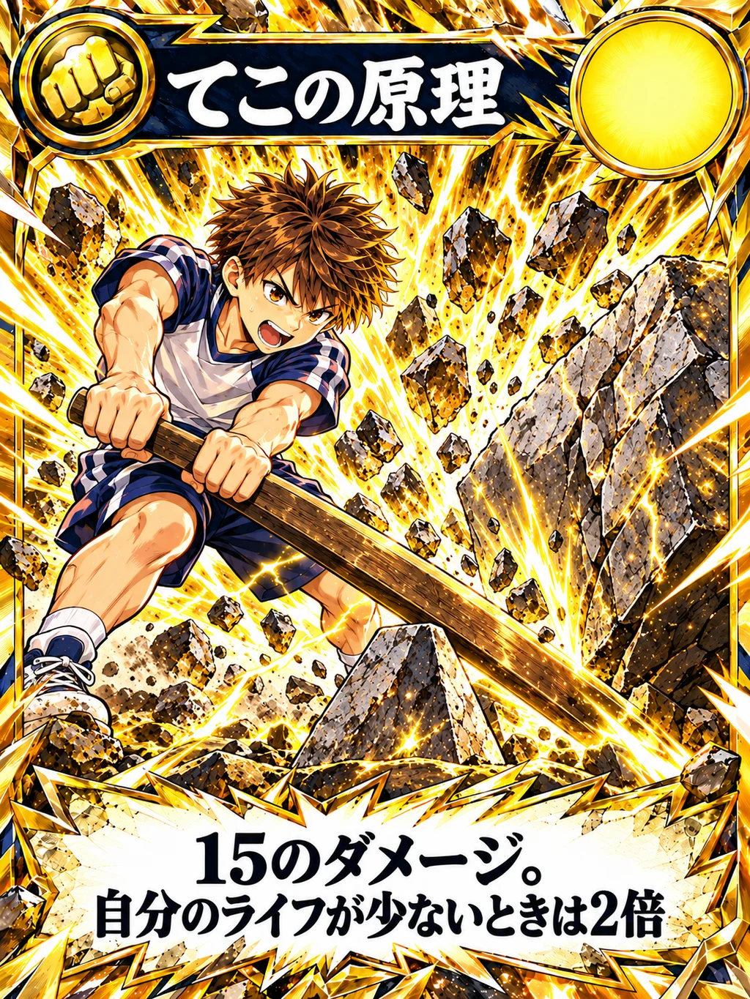

## G017 受け身

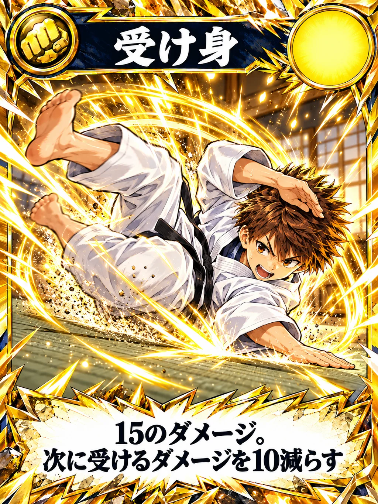

## G021 電動アシスト

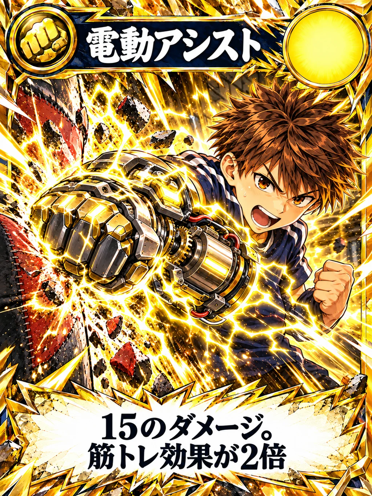

## G009 ぶち切れパンチ

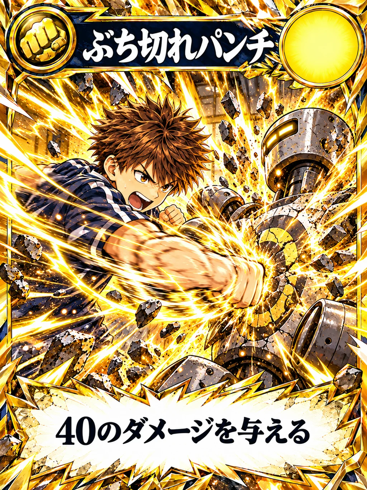

## G010 捨て身タックル

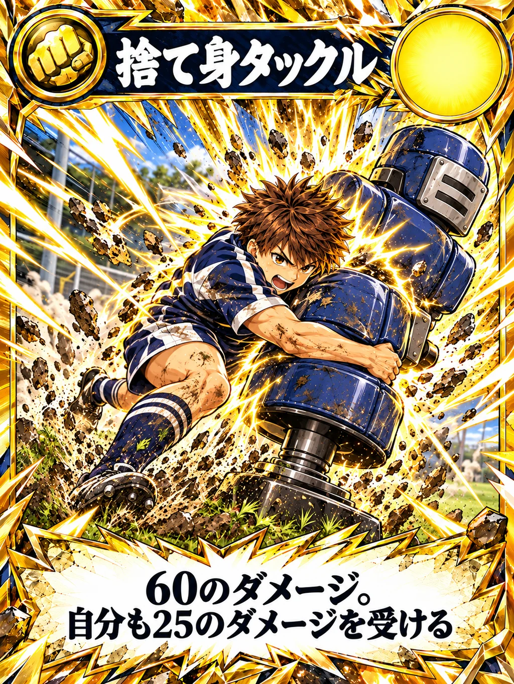

## G012 ベアハッグ

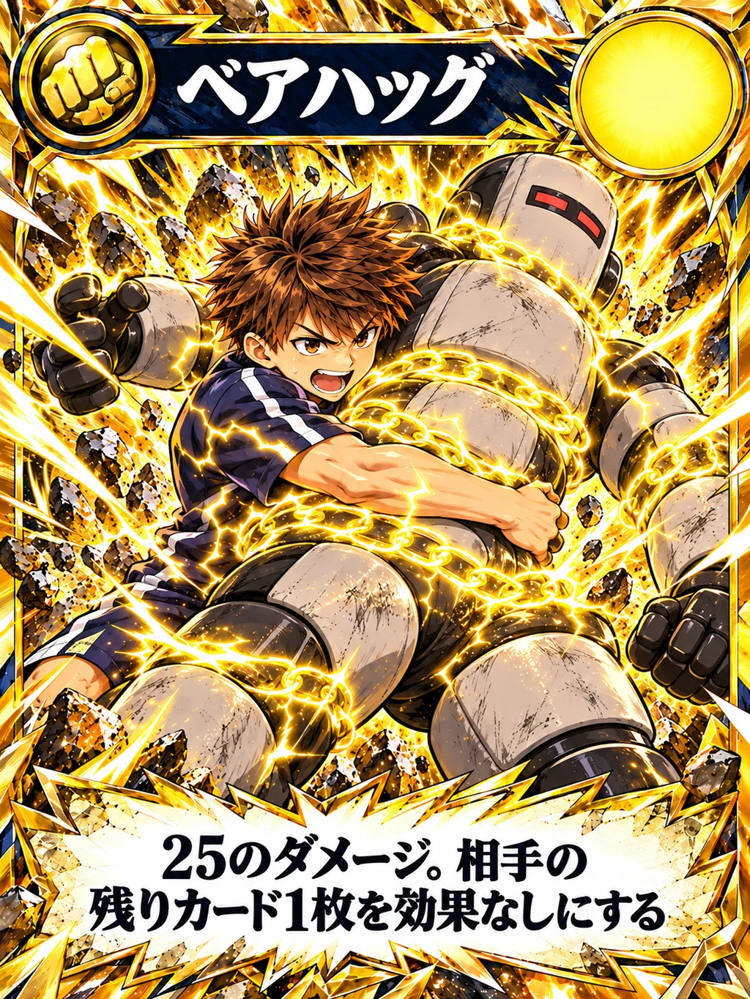

## G022 パワードスーツ

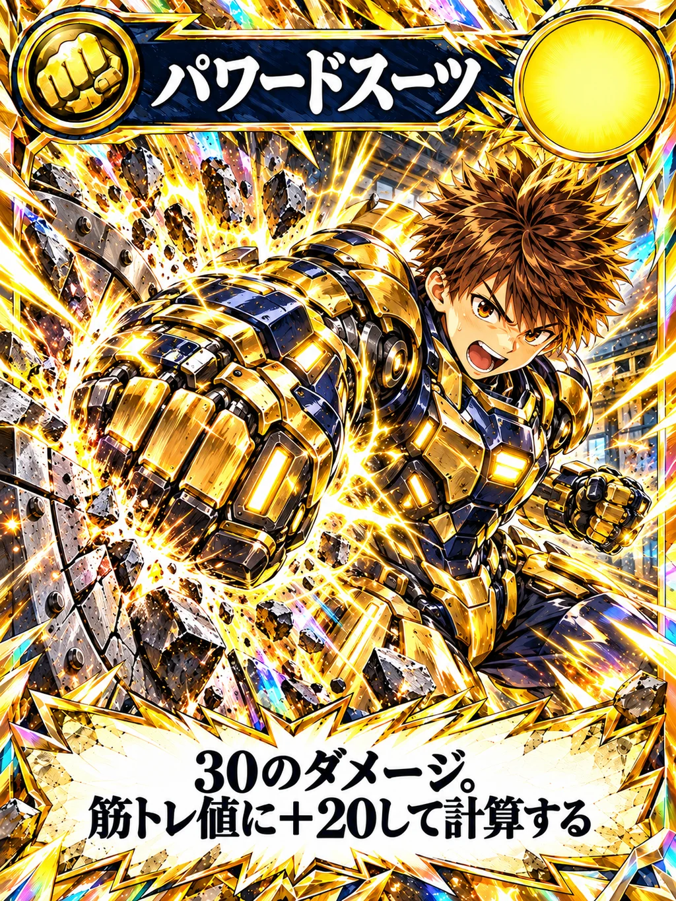

## G015 ジャイアントスイング

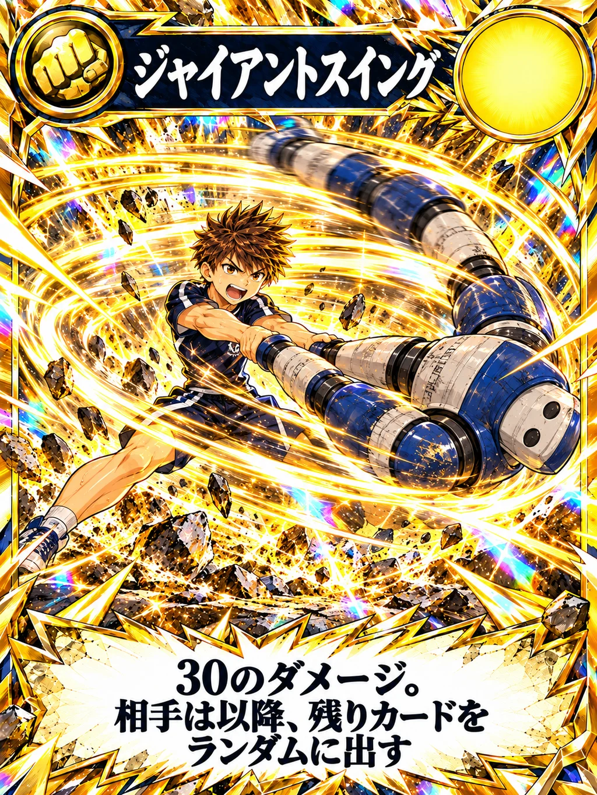
