# チョキ（13枚）

[40枚の一覧へ](README.md)

## C002 のこぎり（既存）

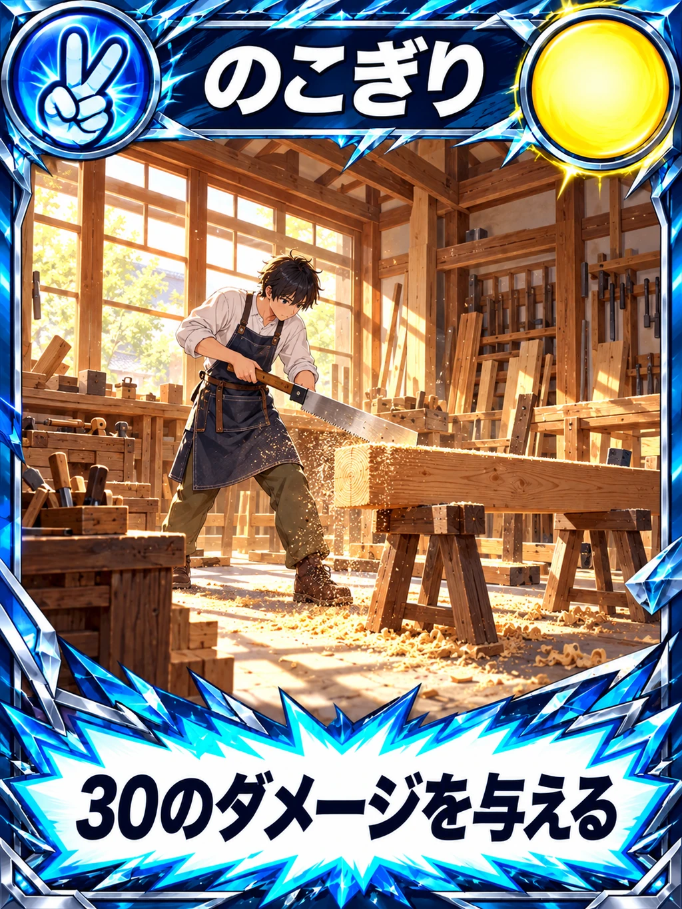

## C003 げんのう

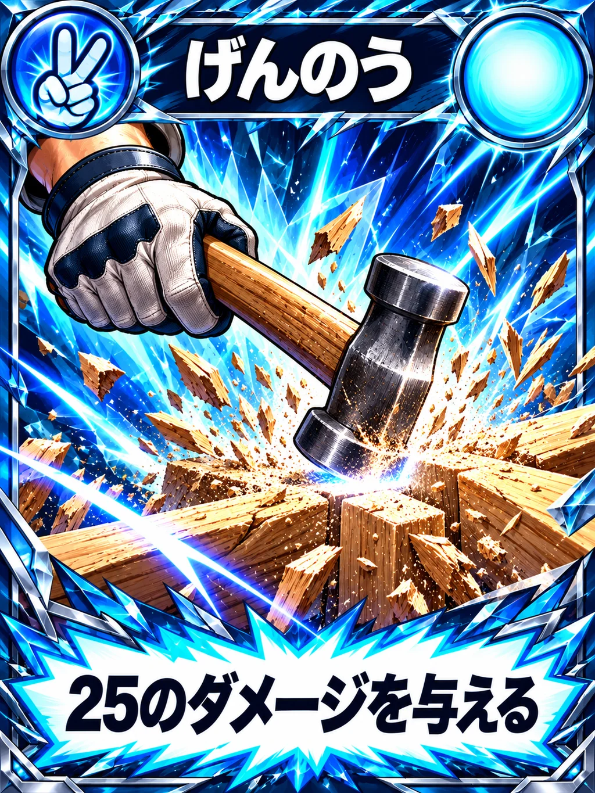

## C016 くぎ

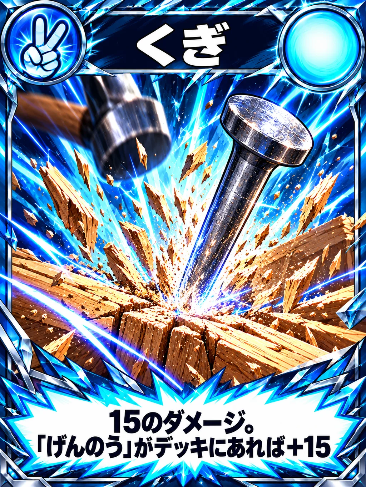

## C004 手裏剣

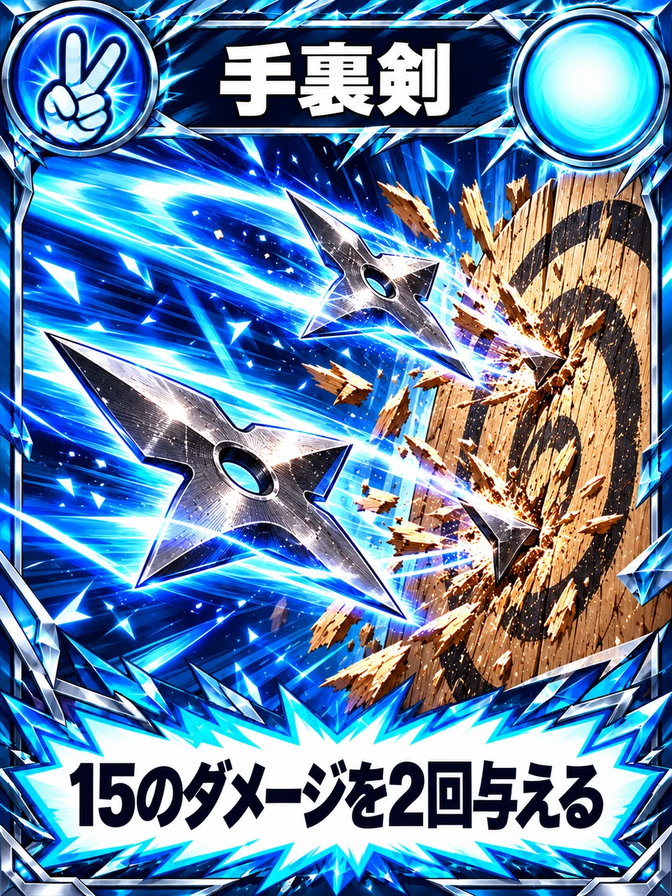

## C008 火縄銃（既存）

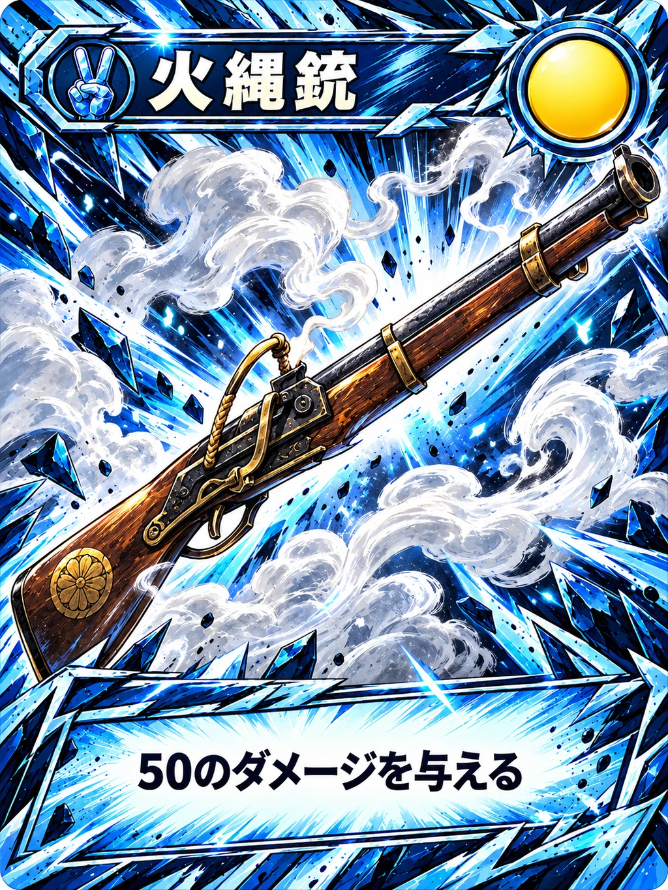

## C006 刀

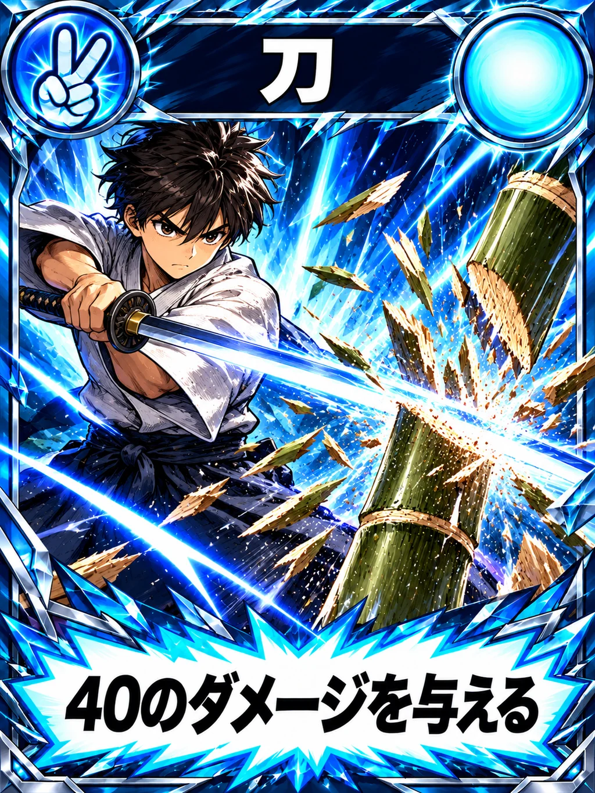

## C007 毒矢

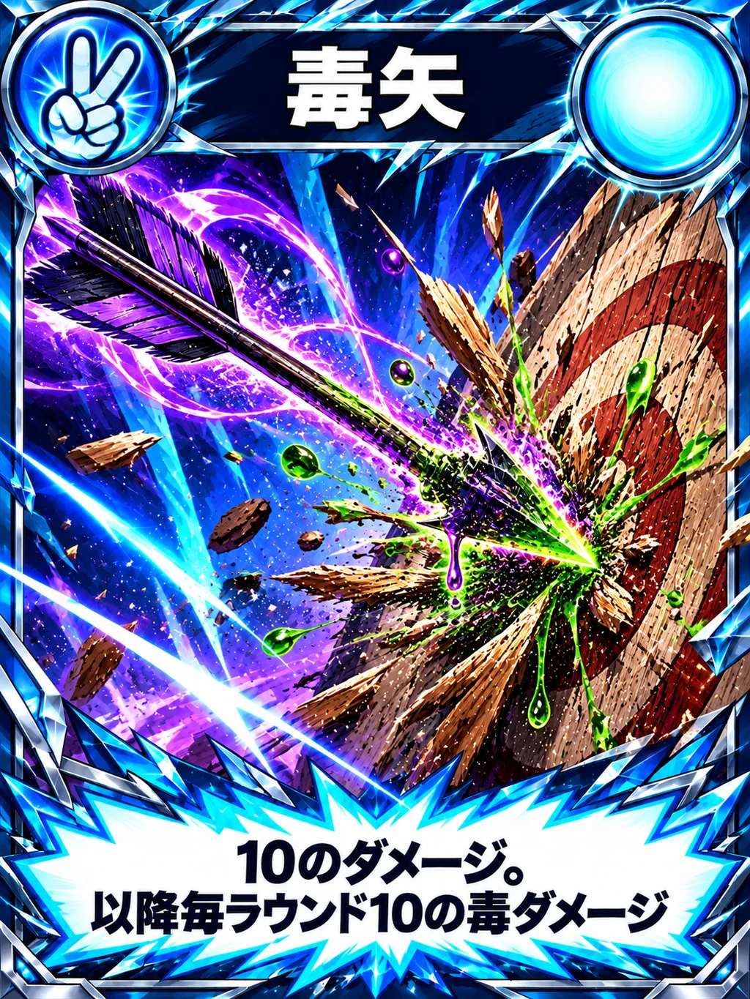

## C017 ドローン

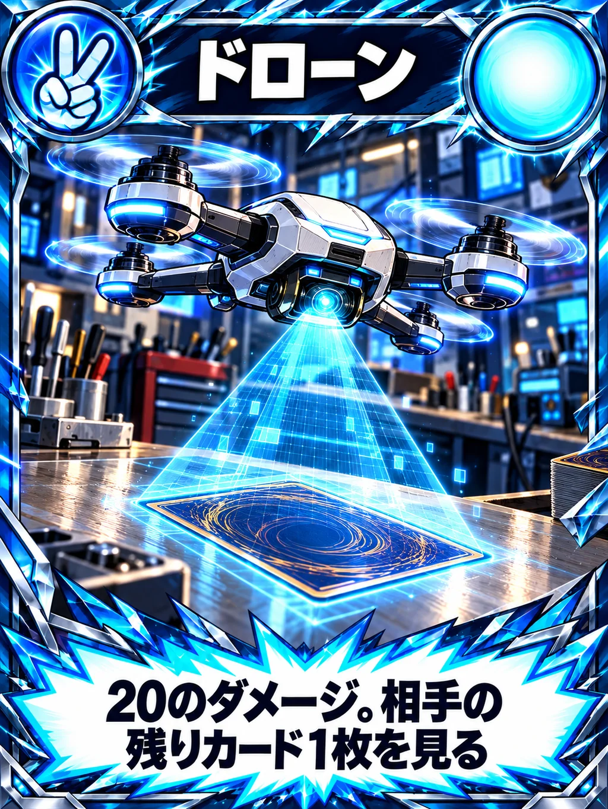

## C010 電動ドリル

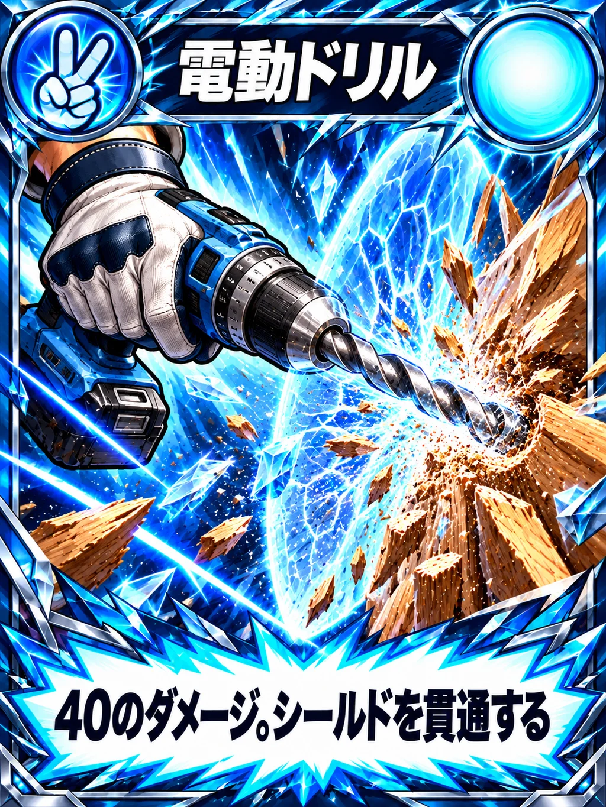

## C011 チェーンソー

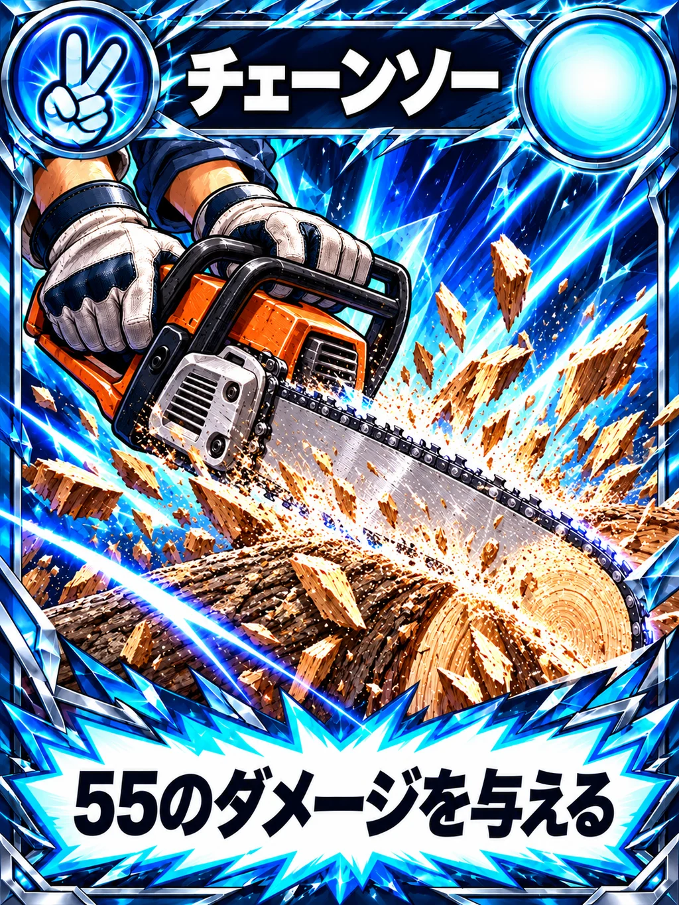

## C013 投石器

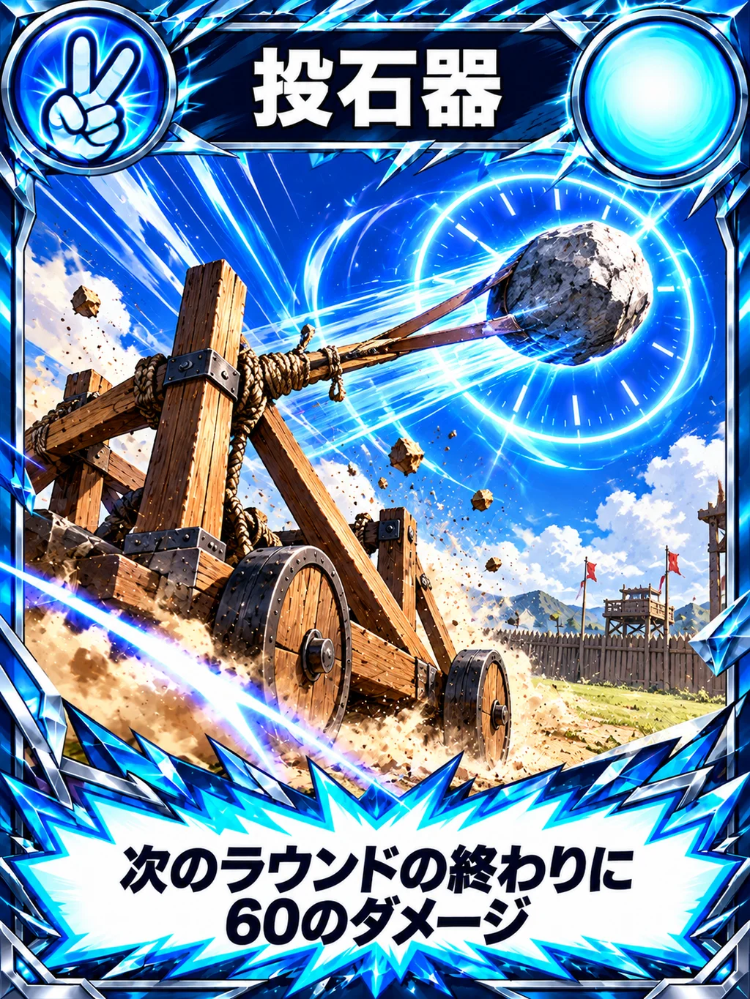

## C014 レーザーカッター（既存）

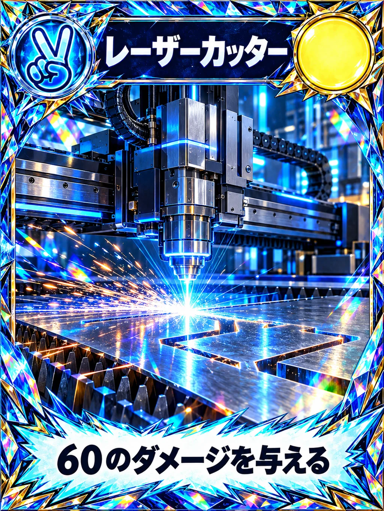

## C015 ロボットアーム

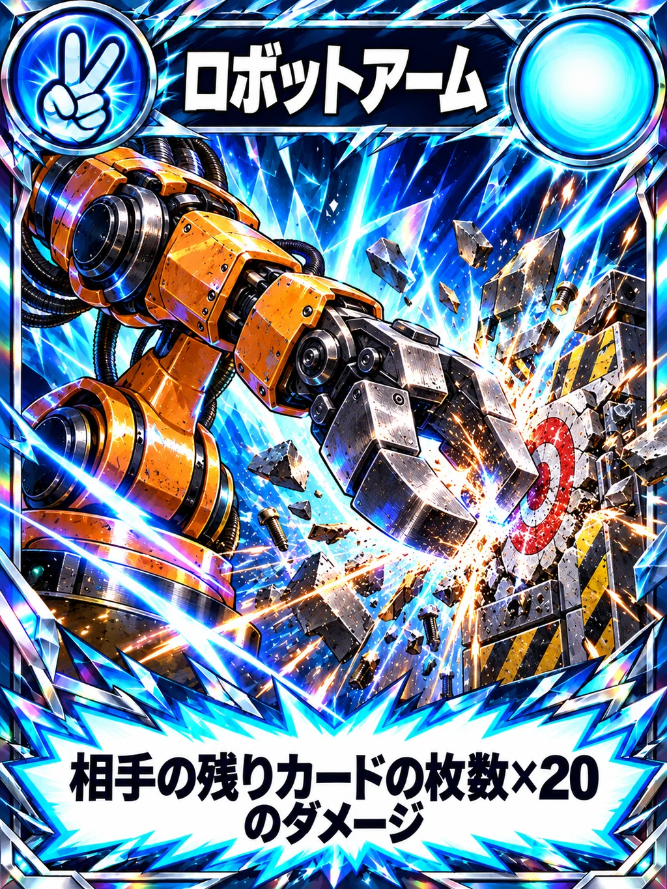
